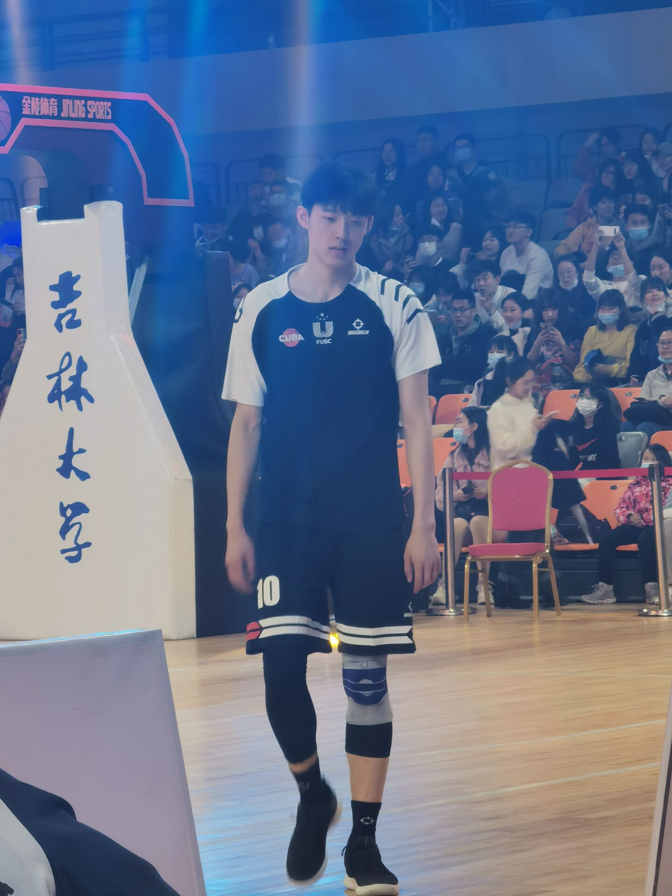

## 温佳龙
### 生日：1999年03月10日
### 学校：吉林大学
### 学院：体育学院
### 身高：199cm

```C
printf("温佳龙最帅！！！");
```

> 温佳龙是吉大最帅的男孩子！

- 温
- 佳
- 龙
- 最
- 帅

1. 打
2. 篮
3. 球
4. 最
5. 厉
6. 害

| 爱好     | 职业生涯 |
| ----------- | ----------- |
| 打篮球      | 吉林大学篮球队       |
| 干饭   | CUBA男篮历史单场得分榜前五        |

**温佳龙**可真帅啊！

*温佳龙*打篮球真棒啊！

~~打篮球受伤~~

---
[温佳龙](https://baike.baidu.com/item/%E6%B8%A9%E4%BD%B3%E9%BE%99/56601251?fr=aladdin "最帅的吉大篮球boy")

[xiyu](./xiyu.md)



