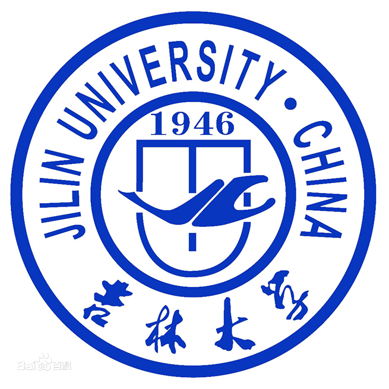

## Xi Shuyao
### 学校：吉林大学


```C
void xiyu{
    printf("C语言是世界上最好的语言");
}
```

> 计算机专业英语令我受益匪浅

- 求实创新
- 励志图强 
  
1. 艰苦创业
2. 奋发向上

   
> 盘点日新楼的美食

|   美食名称   | 打分 |
| ----------- | ----------- |
| 五谷鱼粉      | 99   |
| 麻辣香锅   | 100    |
|金日升烤盘   |  95   |
|张亮麻辣烫  |  90    |
|小柒粥铺    |  93    |

我爱**吉林大学**

我爱*计算机学院*

~~我爱敲代码~~

---
[吉林大学](http://www.jlu.edu.cn/ "JLU——Just Love U")

[README](./README.md)




